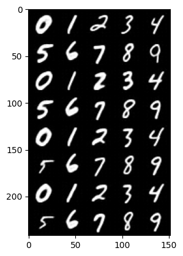

# Simple VQ-VAE implementation

1. Train `VectorQuantize`
2. Train a transformer-based autogressive generator `ARGenerator`

Result:



Run `vis.ipynb` and `vis_ar.ipynb` to see the results.

## Train

```
python train_vq.py --device cuda
python train_ar.py --device cuda -vqvae [...path to your vq checkpoint...]
```